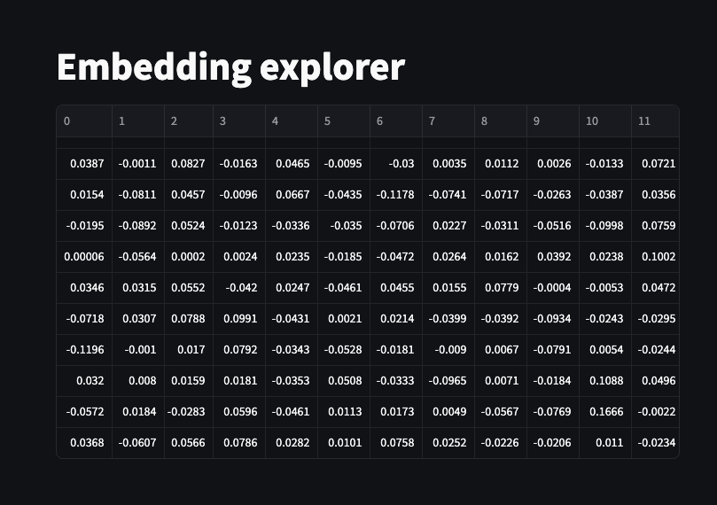
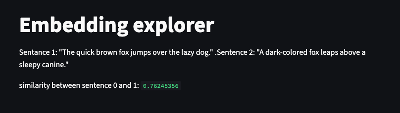
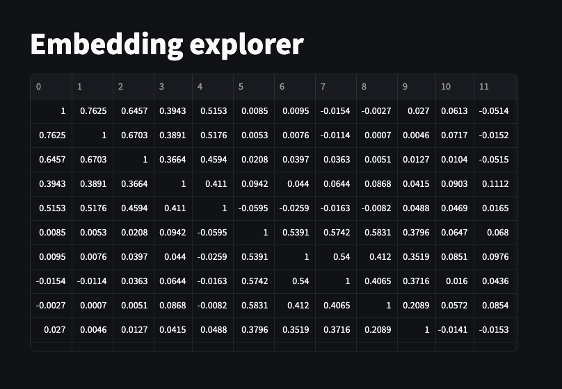
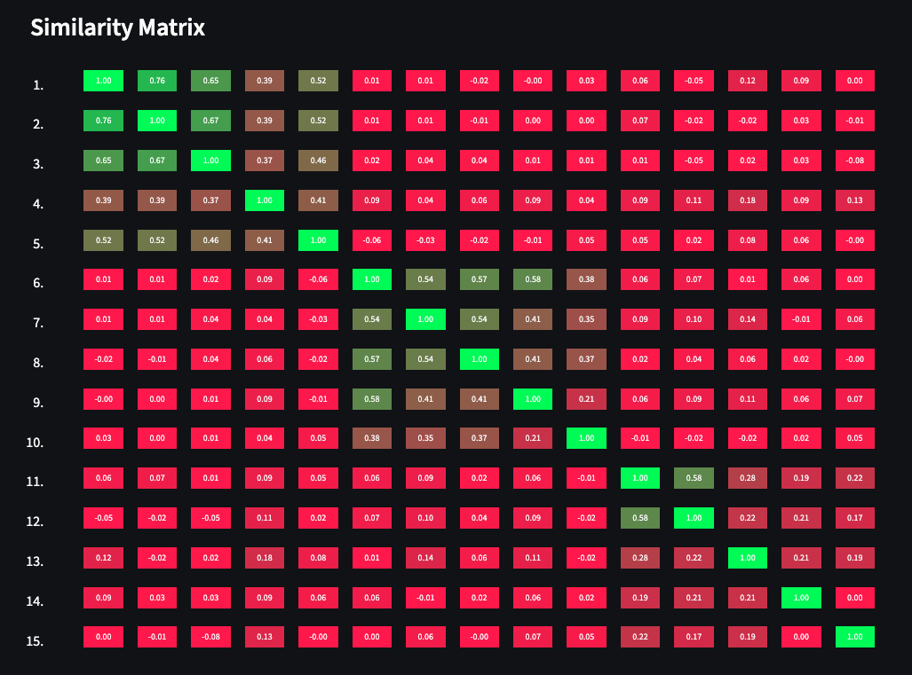
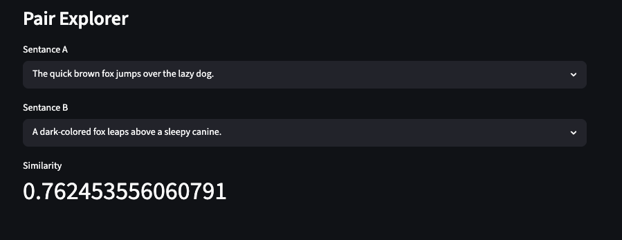
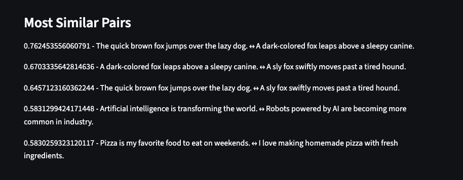

# Episode 004 — Embedding explorer

> [One sentence single takeaway from this project.]

## The Problem / The Question
Is it possible to visualise what embeddings actually are?

## What I Built
Plain English description of what was implemented. What it does and how it works at a high level.

## What I Learned
- Sentence transofrmers (transformers library) was built by HuggingFace to make it easier to generate embeddings on text/images using LLMs
- ALL_CAPS variable name is a Python convention meaning "this doesn't change".
- Using streamlit: @st.cache_... is a decorator you can use before a function and it run this function once, then reuses that result forever. Without it, the function that loads the model reloads every time the page refreshes, which is slow and wasteful.
- @st.cache_resource for resources. Database connections, loaded models, file handles.
- @st.cache_data for data. Numbers, strings, lists, arrays. Things you serialise (copy and store)
- While building with streamlit, st.write() anything you want to inspect 
- No single number in the array/vectors means anything on its own. The meaning is in the relationship between vectors — which is exactly what cosine similarity measures.
- unsafe_allow_html=True lets you use raw HTML inside markdown on Streamlit. Just by putting HTML inside a string 

- [The assumption that broke]
- [The detail worth remembering]

## How to Run
Step-by-step instructions.

Check HuggingFace token is working: 
```
python3 -c "
from huggingface_hub import HfApi
api = HfApi(token='your_token_here')
print(api.whoami()['name'])
"
```

There are different waysto download a model. I will be using HF CLI and download locally on my machine entering the token directly in terminal:
´´´
hf download sentence-transformers/all-MiniLM-L6-v2 --local-dir ~/models/all-MiniLM-L6-v2 --token
´´´

## Tech Used
- [Huggingface](https://huggingface.co/models) -> Tasks -> Feature Extraction -> libraries -> sentence-transformers -> Sort by Most Downloads
> I choose [sentence-transformers/all-MiniLM-L6-v2](https://huggingface.co/sentence-transformers/all-MiniLM-L6-v2) as my local free embeddings model this time. 22.7M parameters, model size of 80MB, runs fully offline. Maps each sentence to a 384-dimensional vector. It is quite small, making it a practical choice. 
- sentence-transformers — downloads and runs the embedding model locally
- streamlit — turns a Python file into a web app, no HTML needed
- numpy — maths library, for the cosine similarity calculation

## Tests 



> Each row is a sentance with 384 vactor embeddings. The whole table is just that, for every sentence against every other sentence. 20 sentences = 400 cells. The matrix is symmetric so that is why we se see numbers appear twice. [0][1] and [1][0] are always the same number


> The colour math: score 1.0 (red=0, green=255 (bright green)) and score 0.0 (red=255, green=0 (red))

> The pair explorer takes a index (displayed as formatted sentences) and compares them to eachother resulting in a similarity score



## References
- [sentence generator](https://randomwordgenerator.com/sentence.php)
- [Creating and Visualizing Embeddings with Sentence Transformers | TensorTeach](https://www.youtube.com/watch?v=5S2Yk45xMLM)
- [Numpy - .zeros method: creates an empty matrix of zeros](https://numpy.org/devdocs/reference/generated/numpy.zeros.html)
-[Streamlit docs](https://docs.streamlit.io/get-started)